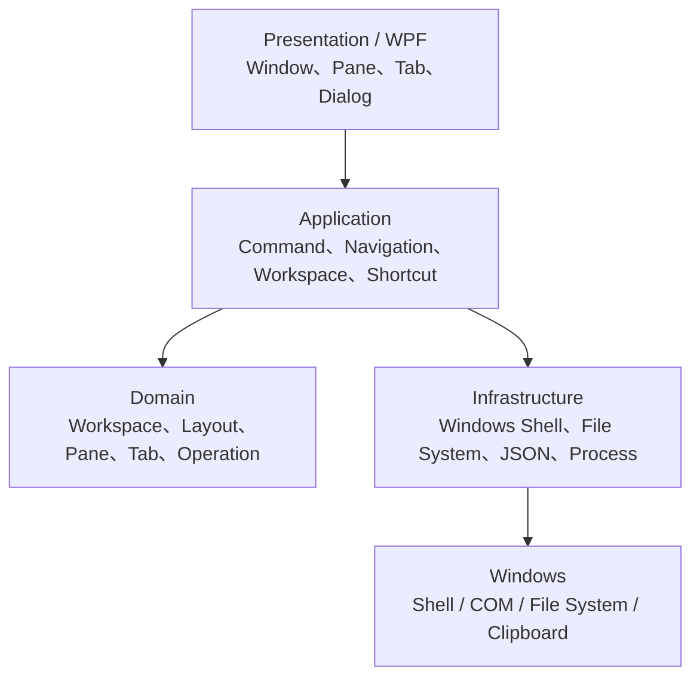
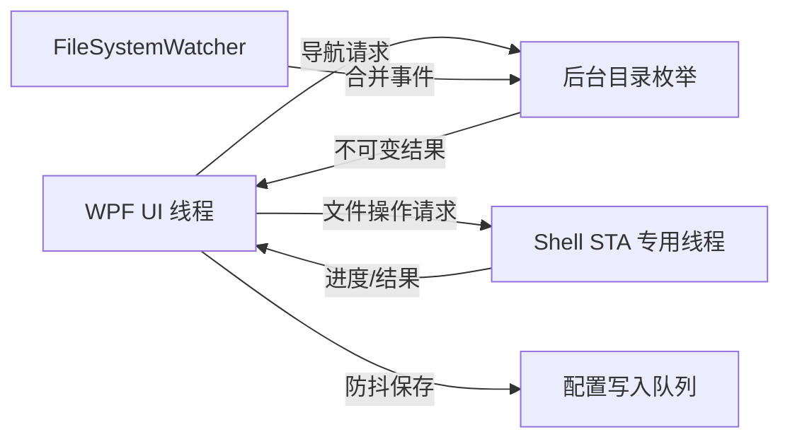
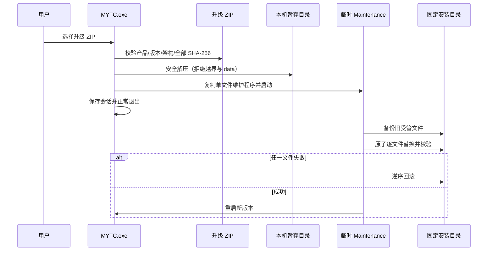

# openTC 技术架构

> openTC 是 MYTC 的新产品品牌。解决方案、项目目录、命名空间和升级内部标识暂时保留 MYTC，以兼容既有绿色安装和用户配置。

状态：v1.0.0 生产扩展已实现  
日期：2026-07-28

## 1. 技术决策

第一版实际采用：

- 语言：C#
- UI：WPF
- 运行时：.NET 10 LTS
- 架构：分层架构 + MVVM
- 发布：Windows x64、自包含、免安装目录发布
- 配置：JSON 文件，保存在程序目录下的 `data/`
- Windows 集成：默认程序打开、Windows `FileDrop`、系统剪贴板、回收站
- 文件操作：托管异步文件操作服务；回收站删除调用 Windows 文件系统集成

第一版推荐发布为“解压即用的绿色目录”，不强求单个 EXE。程序、依赖和便携配置本来就需要形成一个目录；目录发布比运行时解压的单文件模式更直观，也更便于定位和备份配置。

## 2. 选择 WPF 的原因

WPF 只运行在 Windows，具备成熟的 XAML、数据绑定、模板和桌面控件能力，适合高密度文件列表、可调分隔布局和键盘命令。WPF 也支持与其他 Windows 应用之间的拖放。

WinUI 3 同样可以自包含和免安装发布，但需要额外携带 Windows App SDK 运行时，部署结构和原生依赖更复杂。MYTC 第一版以文件操作效率和稳定为主，不需要优先追求 WinUI 3 的视觉体系。

Electron/Tauri/Avalonia 的跨平台优势对当前 Windows 专用项目价值有限，而文件 Shell、回收站、系统拖放和未来默认文件管理器集成最终仍需 Windows 原生互操作。

## 3. 总体结构



## 4. 解决方案结构

建议正式工程采用：

```text
src/
  MYTC.App/                 WPF 界面、启动、依赖组合
  MYTC.Application/         用例、命令、服务接口
  MYTC.Domain/              纯数据模型和业务规则
  MYTC.Infrastructure/      System.IO、Shell、COM、JSON、外部程序
tests/
  MYTC.Domain.Tests/
  MYTC.Application.Tests/
  MYTC.Infrastructure.Tests/
  MYTC.Ui.Tests/
```

## 5. 核心服务

### WorkspaceService

- 新建、加载、保存、另存工作区。
- 恢复上次会话。
- 对工作区进行版本迁移和损坏恢复。

### NavigationService

- 进入目录、上级、后退、前进。
- 普通标签保留最后位置。
- 固定目录标签激活时回到固定路径。
- 处理目录不存在、网络断开和权限不足。

### DirectoryListingService

- 后台枚举目录。
- 生成名称、日期、类型、大小、图标等展示数据。
- 支持取消上一轮枚举，防止快速切换时旧结果覆盖新结果。
- 排序在内存中完成；单目录少于 100 项是主场景，但不设置人工上限。

### DirectoryWatchService

`v0.1.0` 尚未启用 `FileSystemWatcher`。MYTC 自身操作完成后会刷新相关窗格，外部变化可使用每窗格刷新按钮。自动监听和事件合并留到后续版本。

### FileOperationService

- 把复制、移动、重命名、新建和删除统一为操作请求。
- 复制、移动、重命名、新建和永久删除在后台托管任务中执行。
- 统一报告整体进度、跳过项、失败项和取消结果。
- 普通删除调用 Windows 回收站；永久删除使用独立命令并在 UI 二次确认。
- `IFileOperation` 仍是后续版本的增强候选，用于更深的 Shell 语义和系统进度集成。

### DragDropService

- 窗格内和窗格间使用同一文件拖放模型。
- 通过 Windows `FileDrop` 数据格式与资源管理器、桌面及其他程序互通。
- 根据 Ctrl、Shift 等修饰键决定复制或移动，并在放下前显示结果提示。

### ShortcutService

- 所有鼠标、菜单和键盘操作最终调用统一 `CommandId`。
- Windows 剪贴板命令和 TC 目标窗格命令分离。
- 用前缀树匹配单键、组合键和连续键序列。
- 连续键默认等待 1500ms，显示候选提示；Esc 取消。
- 检测完全重复和“短序列是长序列前缀”的冲突。

### ContextMenuService

- 根据所选文件数量、类型和当前目录生成内置菜单。
- 支持调整内置项显示与顺序。
- 支持外部程序命令。
- 外部命令以程序路径与参数模板分开保存；变量替换后通过 `ProcessStartInfo` 启动，不解释来自文件内容的命令。

### PortableDataService

- 数据根目录默认为 `MYTC.exe` 同级的 `data/`。
- 支持启动参数 `--data-dir <path>`，便于测试或未来分离配置。
- 保存失败时不得静默丢失状态，必须提示并保留内存状态。

## 6. 线程模型



- UI 线程只负责显示和轻量状态变更。
- 一个标签发生新导航时取消其旧枚举任务。
- Shell 操作串行进入 STA 队列，第一版不并发执行多个破坏性操作。
- 配置保存防抖，但程序正常退出时必须等待最后一次保存完成。

## 7. 活动窗格与目标窗格

- `activePaneId`：当前键盘、菜单和文件选择作用的窗格。
- `targetPaneId`：TC 风格复制移动的目标。
- 用户从 A 切换到 B 时，B 成为活动窗格，A 成为目标窗格。
- 用户也可以通过命令显式指定目标窗格。
- 两种状态必须使用颜色之外的附加标记，例如“活动”“目标”文字或图标。

## 8. 配置可靠性

保存流程：

1. 序列化到同目录临时文件。
2. 重新读取临时文件并验证 JSON 与版本。
3. 把现有文件保留为 `.bak`。
4. 原子替换正式文件。
5. 启动时正式文件损坏则尝试 `.bak`。

工作区文件不得进入源码仓库，避免泄露真实路径和项目名称。

## 9. Windows 互操作策略

- `v0.1.0` 不包含手写 Win32/COM 互操作层。
- 默认程序打开、剪贴板、拖放和回收站优先使用 .NET/WPF 提供的 Windows 集成。
- 当前使用轻量文件/文件夹字形；Shell 图标缓存留到后续版本。
- 第一版自定义右键菜单不嵌入完整 Windows Shell 菜单。
- 后续成为默认文件管理器时，再独立设计注册表、协议和安装模式。

## 10. 发布结构

```text
MYTC/
  MYTC.exe
  *.dll
  data/
    settings.json
    session.json
    workspaces/
  logs/
  backups/
```

- 发布目标为 `win-x64` 自包含目录。
- 用户无需预装 .NET。
- 更新方式第一版为替换程序文件、保留 `data/`。
- 日志默认限制大小和保留天数，不记录完整自定义命令参数或敏感文件清单。

## 11. 官方依据

- WPF 概览：https://learn.microsoft.com/dotnet/desktop/wpf/overview/
- WPF 拖放：https://learn.microsoft.com/dotnet/desktop/wpf/advanced/drag-and-drop
- .NET 单文件与自包含发布：https://learn.microsoft.com/dotnet/core/deploying/single-file/overview
- .NET 支持策略：https://dotnet.microsoft.com/platform/support/policy
- C# 调用 Win32/CsWin32：https://learn.microsoft.com/windows/apps/develop/interop/call-win32-apis
- IFileOperation：https://learn.microsoft.com/windows/win32/api/shobjidl_core/nn-shobjidl_core-ifileoperation
- IFileOperationProgressSink：https://learn.microsoft.com/windows/win32/api/shobjidl_core/nn-shobjidl_core-ifileoperationprogresssink

## 12. v1.0.0 Windows 接管架构

新增 `MYTC.Maintenance` WinForms 单文件程序，包含三个互相隔离的运行模式：

- 默认模式：显示“注册 / 恢复 Windows 资源管理器”维护窗口。
- `--bridge`：安装 `WH_KEYBOARD_LL` 钩子，仅处理 Win+E；回调只排队启动动作，避免在钩子线程执行慢操作。
- `--apply-update`：作为安装目录之外的更新器，等待 MYTC 退出后替换程序。

注册策略：

- 只修改 `HKCU\Software\Classes\Directory`、`Drive` 和相关 `shell` 动词。
- `Folder` 只增加“在 MYTC 中打开”动词，不把虚拟 Shell 文件夹强制设为默认。
- Win+E 桥接通过当前用户 `Run` 项登录启动。
- 首次写入前记录本用户原值；恢复时删除 MYTC 管理的动词并恢复原值。
- 不修改 Winlogon Shell，不结束或重启 Explorer。

主程序启动策略：

- 互斥体保证同一便携数据目录只有一个主实例。
- 当前用户专用命名管道传递“激活”或“打开目录”请求。
- 收到外部目录后激活窗口，并在当前活动窗格导航。

## 13. v1.0.0 更新架构



- 清单文件为 `MYTC.update.json`，不自我哈希；其余文件必须全部列入且不允许额外文件。
- 更新目标只来自清单，未知用户文件不删除，`data` 明确禁止进入包。
- 旧版备份和日志位于 `%LocalAppData%\MYTC\updates`。
- 临时更新器由新安装目录中的维护程序在父进程退出后清理，避免自身文件锁导致残留。
- 包内 SHA-256 提供完整性检查，不等于发布者代码签名；对外发布仍应提供 ZIP 的独立 SHA-256，未来再接入代码签名证书。
